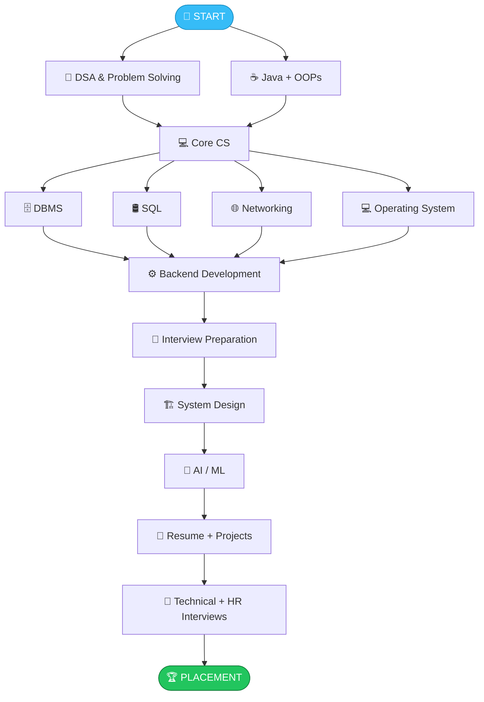
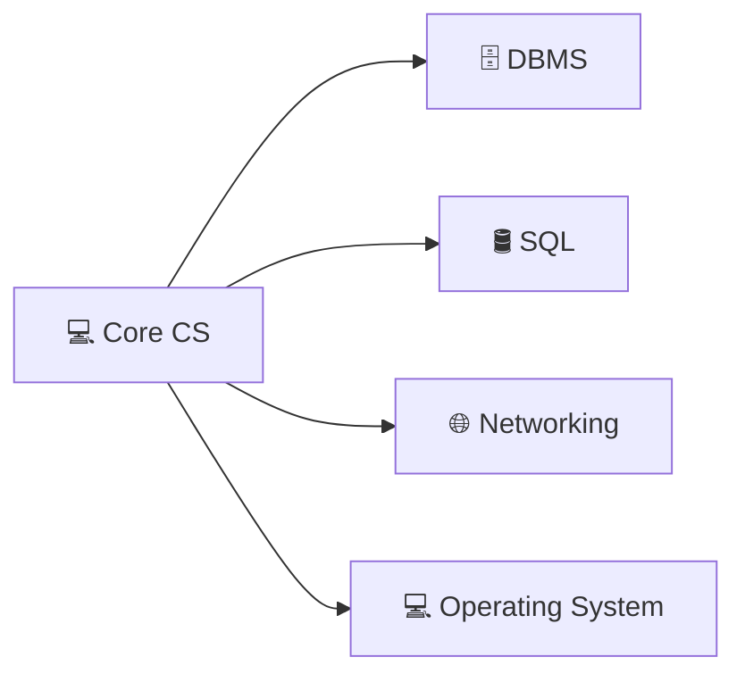
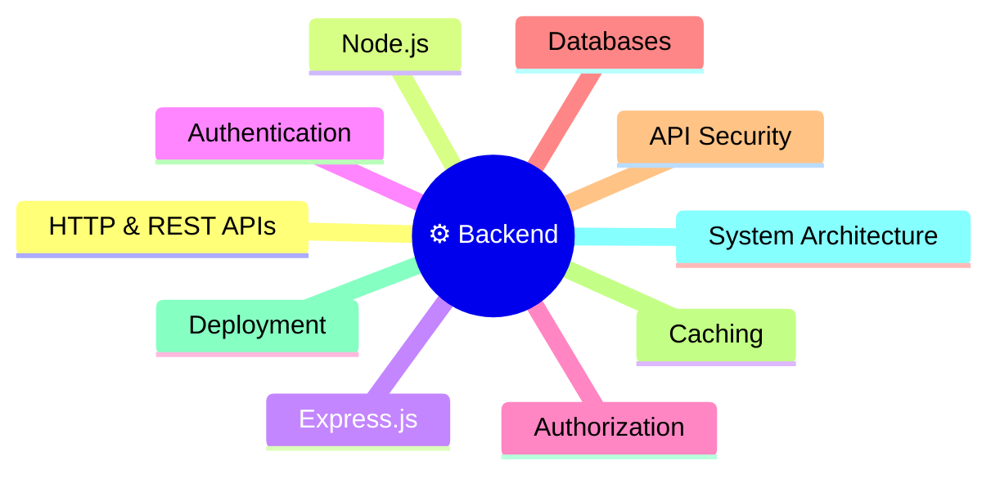
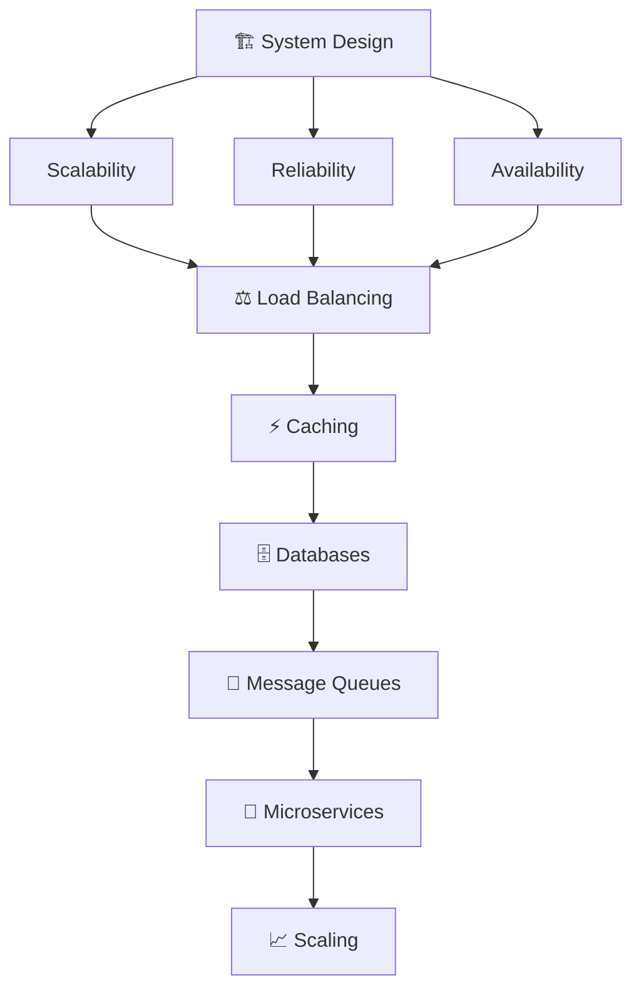
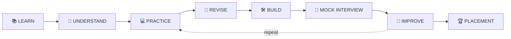

<!-- ========================= HEADER ========================= -->

  

  

  
  
  
  

  
  
  
  
  
  

  📚 Learn &nbsp;•&nbsp; 🧠 Practice &nbsp;•&nbsp; 💻 Build &nbsp;•&nbsp; 🎯 Crack Interviews

---

## 👋 Start Here (Read This First!)

> **Confused about where to begin? You are not alone.**
> This repo gives you **one clear path** with the **best free resources** for each step, so you don't waste time searching.

### ✅ How to use this repo in 3 simple steps

| Step | What to do |
|:---:|---|
| **1️⃣** | Look at the [**roadmap**](#️-the-big-picture) below and see the order of topics. |
| **2️⃣** | Pick **ONE resource per topic** (don't watch everything!) and follow the [**study plan**](#-suggested-study-plan). |
| **3️⃣** | Tick off topics in the [**progress tracker**](#-progress-tracker) as you finish them. |

> 💡 **Golden rule:** One topic → one resource → practice → revise. Then move on.

---

## 📑 Table of Contents

<b>Click to expand / collapse</b>

1. [Who is this for?](#-who-is-this-for)
2. [The Big Picture](#️-the-big-picture)
3. [Suggested Study Plan](#-suggested-study-plan)
4. [Roadmap Sections](#-quick-navigation)
   - [🧠 DSA](#-1-dsa--problem-solving)
   - [💻 Core CS (DBMS, SQL, CN, OS)](#-2-core-computer-science)
   - [☕ Java & OOPs](#-3-java--oops)
   - [⚙️ Backend Development](#️-4-backend-development)
   - [🎯 Interview Preparation](#-5-interview-preparation)
   - [🏗️ System Design](#️-6-system-design)
   - [🤖 AI / ML](#-7-ai--ml-track)
5. [Resume & Projects](#-8-resume--projects)
6. [Progress Tracker](#-progress-tracker)
7. [Daily Routine](#-sample-daily-routine)
8. [Common Mistakes](#-common-mistakes-to-avoid)
9. [FAQ](#-faq)
10. [Contributing](#-contributing)

---

## 🎓 Who is this for?

| 🎯 You are preparing for | ✔️ |
|---|:---:|
| College Placements | ✅ |
| Software Engineering Internships | ✅ |
| Product-Based Companies | ✅ |
| Service-Based Companies | ✅ |
| Technical & System Design Interviews | ✅ |
| AI / ML Roles | ✅ |

**Level:** Beginner → Intermediate. No prior experience needed. 🙌

---

## 🗺️ The Big Picture

Here is the whole journey on one page. **Follow it from top to bottom.**

> 🔁 **Important:** DSA is not a "finish and move on" topic. Solve a few problems **every week** even while learning other topics.

---

## 📅 Suggested Study Plan

> This is a **guide, not a rule.** Go faster or slower based on your time. ⏱️

| 🗓️ Phase | ⏳ Duration | 🎯 Focus | ✅ Goal |
|:---:|:---:|---|---|
| **Phase 1** | Weeks 1–4 | Java basics + OOPs, start DSA basics (arrays, strings) | Comfortable writing code |
| **Phase 2** | Weeks 5–12 | DSA deep dive (recursion, trees, graphs, DP) | 150+ problems solved |
| **Phase 3** | Weeks 8–14 | Core CS: DBMS, SQL, OS, CN | Can explain concepts simply |
| **Phase 4** | Weeks 12–18 | Backend development + 1–2 projects | Projects on GitHub |
| **Phase 5** | Weeks 16–22 | Interview prep + System Design basics | Mock interviews done |
| **Phase 6** | Weeks 20–24 | AI/ML basics, Resume polish, apply | Applications sent 🚀 |

*(Phases overlap on purpose. Keep solving DSA problems throughout.)*

---

## 🧭 Quick Navigation

| 🚀 Section | 📚 Topics | ⭐ Priority |
|---|---|:---:|
| 🧠 [**DSA**](#-1-dsa--problem-solving) | Data Structures, Algorithms, Patterns | 🔥🔥🔥 |
| 💻 [**Core CS**](#-2-core-computer-science) | DBMS, SQL, CN, OS | 🔥🔥🔥 |
| ☕ [**Java & OOPs**](#-3-java--oops) | Java, OOPs, DSA Notes | 🔥🔥🔥 |
| ⚙️ [**Development**](#️-4-backend-development) | Backend Development | 🔥🔥 |
| 🎯 [**Interview Prep**](#-5-interview-preparation) | Interview Questions & Revision | 🔥🔥🔥 |
| 🏗️ [**System Design**](#️-6-system-design) | Scalable System Architecture | 🔥🔥 |
| 🤖 [**AI / ML**](#-7-ai--ml-track) | Gen AI, AI Engineering, ML | 🔥 |
| 🏆 [**Final Stage**](#-8-resume--projects) | Resume, Projects, Technical + HR | 🔥🔥🔥 |

---

# 🧠 1. DSA & Problem Solving

> **In simple words:** DSA (Data Structures & Algorithms) teaches you how to **think and solve problems efficiently**. Almost every company tests this.

**You will learn:** Arrays • Strings • Linked List • Stack & Queue • Trees • Graphs • Recursion • Dynamic Programming • Greedy • Sorting & Searching

## ⭐ Recommended Resources

| # | 🎬 Creator / Resource | 📌 What you get | 🔗 Link |
|:---:|---|---|:---:|
| 1 | **Roadmaps & Resource Overview** | DSA sheets, roadmaps, patterns, interview keywords, strategies | [GitHub Repo](https://github.com/nirmaltodwal7/Roadmaps-Resource-Overview) |
| 2 | **Striver** | Structured DSA course | [YouTube Playlist](https://youtube.com/playlist?list=PLgUwDviBIf0oF6QL8m22w1hIDC1vJ_BHz&si=h9rT7bFwFvEYfu4J) |
| 3 | **Padho with Pratyush** | DSA playlist | [YouTube Playlist](https://youtube.com/playlist?list=PLbJhGqY-mq47k_WLUtzVjmarUm1EuXPj2&si=9V_lFHHL3ZSs3LLm) |
| 4 | **CTO Bhaiya — DSA 90 Days** | 90-day DSA plan | [YouTube Playlist](https://youtube.com/playlist?list=PLVItHqpXY_DArKRcfmGWykqV3u4hDaJLo&si=ywEYuQfwqUKwfmIo) |
| 5 | **CTO Bhaiya — DSA Patterns** | Learn common problem patterns | [YouTube Playlist](https://youtube.com/playlist?list=PLVItHqpXY_DDFNeS6NUUoRsloyaPRdl1l&si=tlsPfHpVotag3lJ7) |
| 6 | **Aditya Verma — Dynamic Programming** | Dedicated DP series | [YouTube Playlist](https://youtube.com/playlist?list=PL_z_8CaSLPWekqhdCPmFohncHwz8TY2Go&si=HmDQ5ScFKzJnm0g0) |

> 🧭 **Which one to pick?**
> Choose **one main course** (Striver *or* Padho with Pratyush *or* CTO Bhaiya 90 Days). Then use **DSA Patterns** and **Aditya Verma (DP)** as add-ons.

💡 <b>Tips for learning DSA (click to open)</b>

- Watch a video → **close it** → try solving the problem yourself first.
- Stuck for 30 minutes? Read the hint/solution, then **re-solve it the next day** without looking.
- Write down the **pattern** behind every problem (two pointers, sliding window, etc.).
- Consistency beats intensity: **1–2 problems daily** > 20 problems once a month.

---

# 💻 2. Core Computer Science

> **In simple words:** These are the "theory subjects" every interviewer asks about. Learn them once, revise often.

---

## 🗄️ DBMS

> **What it covers:** Databases, normalization, transactions (ACID), indexing, and database design.

| # | 🎬 Creator | 🔗 Link |
|:---:|---|:---:|
| 1 | **Vivek Gupta** | [YouTube Video](https://youtu.be/2LOpVPMiGUw) |
| 2 | **Gate Smashers** | [YouTube Playlist](https://youtube.com/playlist?list=PLxCzCOWd7aiFAN6I8CuViBuCdJgiOkT2Y&si=L74jpBSV67qKhgJu) |

---

## 🛢️ SQL

> **What it covers:** How to store, fetch, update, and analyze data in relational databases. (Joins, GROUP BY, subqueries...)

| # | 🎬 Creator | 🔗 Link |
|:---:|---|:---:|
| 1 | **Engineering Digest** | [YouTube Playlist](https://youtube.com/playlist?list=PLA3GkZPtsafZj87jyyITew3oySyECQ4tS&si=uWMSPoE2XXYM_MRG) |

---

## 🌐 Computer Networking

> **What it covers:** How computers talk to each other: HTTP, TCP/IP, DNS, and more.

| # | 🎬 Creator | 🔗 Link |
|:---:|---|:---:|
| 1 | **BridgeWhy** | [YouTube Playlist](https://youtube.com/playlist?list=PLWc4KyLBvvTbAx6MkOZfVyOjR4J4ZL9QA&si=Wuq9xGLOCmn-cmZA) |
| 2 | **Kunal Kushwaha** | [YouTube Video](https://youtu.be/IPvYjXCsTg8) |

---

## 💻 Operating System

> **What it covers:** Processes, threads, scheduling, memory management, deadlocks, synchronization, file systems.

| # | 🎬 Creator | 🔗 Link |
|:---:|---|:---:|
| 1 | **Vivek Gupta** | [YouTube Playlist](https://youtube.com/playlist?list=PLqf9emQRQrnILKCBLpTR-YzuHQHA_6QQx&si=v9Vt_YIl3drZkZD4) |
| 2 | **Gate Smashers** | [YouTube Playlist](https://youtube.com/playlist?list=PLxCzCOWd7aiGz9donHRrE9I3Mwn6XdP8p&si=GeJ1MGohAgp1AQXR) |

---

# ☕ 3. Java & OOPs

> **In simple words:** Java is the language you code in, and OOPs is the way you organize your code into reusable pieces.

**The 4 pillars of OOPs (remember these!):**

| 🧱 Pillar | 💬 One-line meaning |
|---|---|
| **Encapsulation** | Wrap data and methods together; hide the details |
| **Abstraction** | Show only what's necessary |
| **Inheritance** | A class can reuse another class's features |
| **Polymorphism** | One thing, many forms |

## 📚 Video Resource

| # | 🎬 Creator | 🔗 Link |
|:---:|---|:---:|
| 1 | **Kunal Kushwaha** | [YouTube Playlist](https://youtube.com/playlist?list=PL9gnSGHSqcno1G3XjUbwzXHL8_EttOuKk&si=FOVSJHIm_iwog-Xd) |

## 📒 Java DSA & OOPs Notes

A complete Java preparation resource with fundamentals, OOPs, DSA notes, handwritten notes, cheat sheets, books and interview material.

🔗 **[GitHub Repository — Java DSA OOPs Notes](https://github.com/nirmaltodwal7/Java-DSA-OOPS-main)**

| 📦 Includes | |
|---|---|
| ☕ Java Basics | 🧱 OOPs Concepts |
| 🧠 DSA | 📝 Handwritten Notes |
| 📚 Cheat Sheets | 📖 Reference Books |
| 🎯 Interview Preparation | |

---

# ⚙️ 4. Backend Development

> **In simple words:** Backend is the "brain" behind apps. It handles data, logins, and APIs, and it is what your frontend talks to.

## 📚 Resource

| # | 🎬 Creator | 🔗 Link |
|:---:|---|:---:|
| 1 | **Sriniously** | [YouTube Playlist](https://youtube.com/playlist?list=PLui3EUkuMTPgZcV0QhQrOcwMPcBCcd_Q1&si=6wbrDTLZ7l8OXm5E) |

### 🔥 Important Backend Topics

---

# 🎯 5. Interview Preparation

> **In simple words:** This is where you **revise everything** and practice answering questions the way interviewers ask them.

## 📒 Interview Preparation Notes

A complete interview-prep repository with interview questions, DSA sheets, coding resources, and notes on OOPs, OS and more.

🔗 **[GitHub Repository — Interview Preparation Notes](https://github.com/nirmaltodwal7/Interview-Preparation-Notes-master)**

### 📌 Important Topics Checklist

| | | |
|---|---|---|
| 🧠 Interview Questions | 💻 DSA & Coding Problems | ☕ OOPs |
| 💻 Operating Systems | 🗄️ DBMS | 🌐 Computer Networks |
| 🔥 DSA Sheets | 🌳 Trees & Graphs | ⚡ Dynamic Programming |
| 🔄 Recursion & Backtracking | 💡 Greedy Algorithms | 🔢 Bit Manipulation |
| 🔍 Searching & Sorting | 📝 Technical Interview Prep | |

---

# 🏗️ 6. System Design

> **In simple words:** How do you build an app like WhatsApp or YouTube that **millions of people** can use at the same time? That's System Design.
>
> 💡 *Start this after you are comfortable with DSA, Core CS and one backend project.*

## 📚 Resources

| # | 🎬 Creator | 🔗 Link |
|:---:|---|:---:|
| 1 | **Engineering Digest** | [YouTube Playlist](https://youtube.com/playlist?list=PLA3GkZPtsafZdyC5iucNM_uhqGJ5yFNUM&si=yXLfsIyMqw17FH3m) |
| 2 | **ByteByteGo** | [YouTube Playlist](https://youtube.com/playlist?list=PLCRMIe5FDPseVvwzRiCQBmNOVUIZSSkP8&si=2J8Dl3F3xSJMA4Of) |
| 3 | **Mayank Joshi** | [YouTube Playlist](https://youtube.com/playlist?list=PLtUBJBQF5VJgSzegWtlFiNTWehra8eSHU&si=Hof8_AtKhjBmAd7W) |
| 4 | **Piyush Garg** | [YouTube Playlist](https://youtube.com/playlist?list=PLinedj3B30sBlBWRox2V2tg9QJ2zr4M3o&si=9MlqRnwED4vjBqQ-) |
| 5 | **Harkirat Singh** | [YouTube Video](https://youtu.be/8nev8kVUegk) |

### 🧩 System Design Fundamentals

---

# 🤖 7. AI / ML Track

> **In simple words:** AI skills are in high demand. Learn how to **use** AI models in real apps, and how ML works under the hood.
>
> 💡 *Do this after the core topics above. It's a bonus that makes your profile stand out.*

### 🤖 Gen AI
> **What it covers:** Models and apps that generate text, code, images, audio and more.

| # | 🎬 Creator | 🔗 Link |
|:---:|---|:---:|
| 1 | **TechSimPlus Learning** | [YouTube Playlist](https://youtube.com/playlist?list=PLUhY5ME1VdItcTMnzYakPdYJWorU6IdKk&si=redWzRuGqb2_vabl) |
| 2 | **Piyush Garg** | [YouTube Playlist](https://youtube.com/playlist?list=PLinedj3B30sCzJnjhtEZBpKGtC1Xk7z5Z&si=Gw8QLTOkReA33fVN) |
| 3 | **Sheryians AI School** | [YouTube Playlist](https://youtube.com/playlist?list=PLaldQ9PzZd9oXR4PMGR4pr_DX4wFHkFwR&si=gwa7dqQuAxZPA6iZ) |

### 🛠️ AI Engineering
> **What it covers:** Building real-world apps using AI models, APIs, agents and LLMs.

| # | 🎬 Creator | 🔗 Link |
|:---:|---|:---:|
| 1 | **Telusko** | [YouTube Playlist](https://youtube.com/playlist?list=PLsyeobzWxl7q_w9UgGWraeMSACk7j93eV&si=XtNTHLuu_QSo9SKL) |

### 📊 Machine Learning
> **What it covers:** Systems that learn patterns from data to make predictions.

| # | 🎬 Creator | 🔗 Link |
|:---:|---|:---:|
| 1 | **Sheryians AI School** | [YouTube Playlist](https://youtube.com/playlist?list=PLaldQ9PzZd9qT0KsKJ7yCq70iFFP3MFJ5&si=JIw0rcbInnVcYG2B) |

---

# 📝 8. Resume & Projects

> **In simple words:** Skills get you the interview. Your **resume and projects** get you noticed in the first place.

### 📄 Resume Checklist

- [ ] Keep it to **1 page**
- [ ] Add **2–3 strong projects** (with GitHub links)
- [ ] Use **numbers**: *"Reduced API response time by 40%"*
- [ ] List skills honestly. Only what you can explain in an interview
- [ ] Add your **GitHub, LinkedIn and coding profile** links

### 💡 Project Ideas

| 🟢 Beginner | 🟡 Intermediate | 🔴 Advanced |
|---|---|---|
| To-Do / Notes App | Authentication system (JWT) | URL Shortener with caching |
| Weather App | Blog / E-commerce backend | Chat app with real-time messaging |
| Calculator / Quiz App | REST API with SQL database | AI-powered app using LLM APIs |

### 🎤 Interview Rounds at a glance

| Round | What they check | How to prepare |
|---|---|---|
| 💻 Online Test | DSA + aptitude | Practice daily on coding platforms |
| 🧠 Technical Round | DSA, Core CS, projects | Revise notes + explain your projects |
| 🏗️ System Design | Design thinking | Practice 1 design per week |
| 🗣️ HR Round | Communication, attitude | Prepare "Tell me about yourself" and common HR questions |

---

# 📊 Progress Tracker

> 📌 **Tip:** Fork this repo, then tick the boxes by editing this file as you learn. Seeing progress keeps you motivated! 💪

### 🧠 DSA
- [ ] Arrays & Strings
- [ ] Recursion & Backtracking
- [ ] Linked List, Stack, Queue
- [ ] Trees & Graphs
- [ ] Dynamic Programming
- [ ] Greedy, Bit Manipulation, Searching & Sorting

### 💻 Core CS
- [ ] DBMS
- [ ] SQL
- [ ] Computer Networks
- [ ] Operating System

### ☕ Development
- [ ] Java + OOPs
- [ ] Backend Basics (HTTP, REST, Node/Express)
- [ ] Authentication & Databases
- [ ] Project 1 completed
- [ ] Project 2 completed

### 🎯 Final Stage
- [ ] System Design basics
- [ ] AI / ML basics
- [ ] Resume ready
- [ ] 5+ Mock interviews done
- [ ] Started applying 🚀

---

# ⏰ Sample Daily Routine

> *Adjust based on your college schedule.*

| ⏰ Time | 📌 Activity |
|---|---|
| 🌅 1–2 hrs | **DSA**: learn 1 concept + solve 2 problems |
| 🌤️ 1 hr | **Core CS / Java**: watch lectures, make notes |
| 🌇 1–2 hrs | **Project / Development**: build something |
| 🌙 30 min | **Revise**: today's notes + yesterday's problems |
| 📅 Weekend | **Mock interview / contest / weekly revision** |

---

# ⚠️ Common Mistakes to Avoid

| ❌ Mistake | ✅ Do this instead |
|---|---|
| Watching 10 playlists for one topic | Pick **one** and finish it |
| Only watching videos, never coding | Code along and solve problems yourself |
| Copying solutions without understanding | Understand → close → re-solve |
| Skipping Core CS (OS, DBMS, CN) | Revise them. Interviewers love asking! |
| No projects on resume | Build at least 2 real projects |
| Starting everything at once | Follow the roadmap **step by step** |
| Never giving mock interviews | Practice speaking your answers out loud |

---

# ❓ FAQ

<b>Do I need to learn everything in this repo?</b>

No. Focus on **DSA + Core CS + Java/OOPs + Projects** first. System Design and AI/ML are bonuses, and more important for product-based companies and advanced roles.

<b>I'm a complete beginner. Where do I start?</b>

Start with **Java + OOPs** and the basics of **DSA** (arrays, strings). Then continue down the roadmap in order.

<b>Which programming language should I use?</b>

This roadmap uses **Java**, but C++ and Python also work for DSA. Pick **one** language and stick with it.

<b>How many DSA problems should I solve?</b>

Quality matters more than quantity. Aim for **150–300 well-understood problems** across all topics, with regular revision.

<b>How long will this take?</b>

Roughly **4–6 months** with consistent daily effort. See the [study plan](#-suggested-study-plan).

---

# 🏆 The Preparation Formula

> ### 💡 Important Rule
> **Don't try to learn everything at once.**
> Build strong fundamentals → Practice consistently → Build projects → Revise → Give interviews → Improve.

---

# 🤝 Contributing

Found a better resource or a broken link? Contributions are welcome! 🙌

1. 🍴 **Fork** this repository
2. 🌿 Create a new branch (`git checkout -b add-new-resource`)
3. ✏️ Add your resource or fix
4. 📤 Open a **Pull Request**

---

# 🌟 Keep Learning

### 🚀 Learn • Build • Practice • Revise • Repeat

### 💻 Code Every Day. Think Every Day. Improve Every Day.

**Your consistency today decides your opportunities tomorrow. 🔥**

  

  ⭐ <b>If this roadmap helps you, please give the repository a star!</b> ⭐ 
  🔁 Share it with friends who are preparing for placements.

  

